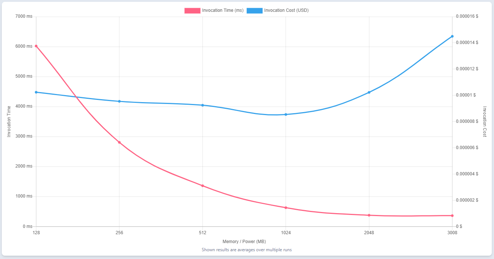

## Lambda Demo with .NET

With the release of .NET 6 [AWS Lambda](https://aws.amazon.com/lambda/) now supports .NET Core 3.1 and .NET 6 as managed runtimes. With the availability of ARM64 using Graviton2 there have been vast improvements to using .NET with Lambda.

But how does that translate to actual application performance? And how does .NET compare to other available runtimes. This repository contains a simple serverless application across a range of .NET implementations and the corresponding benchmarking results.

## Application


The application consists of an [Amazon API Gateway](https://aws.amazon.com/api-gateway/) backed by four Lambda functions and an [Amazon DynamoDB](https://aws.amazon.com/dynamodb/) table for storage.

It includes the below implementations as well as benchmarking results for both x86 and ARM64:

- .NET Core 3.1
- .NET Core 3.1 with Open Telemetry tracing
- .NET 6 Lambda
- .NET 6 Top Level statements
- .NET 6 Minimal API
- .NET 6 Minimal API with AWS Lambda Web Adapter
- .NET 6 NativeAOT compilation
- .NET 7 Custom Runtime
- .NET 7 NativeAOT compilation
- .NET 7 Minimal API with NativeAOT compilation
- .NET 8
- .NET 8 Minimal API

## Requirements

- [AWS CLI](https://aws.amazon.com/cli/)
- [AWS SAM](https://aws.amazon.com/serverless/sam/)
- .NET 6 OR .NET Core 3.1
- [Artillery](https://www.artillery.io/) for load-testing the application
- Docker

## Software

There are four implementations included in the repository, covering a variety of Lambda runtimes and features. All the implementations use 1024MB of memory with Graviton2 (ARM64) as default. Tests are also executed against x86_64 architectures for comparison.

There is a separate project for each of the four Lambda functions, as well as a shared library that contains the data access implementations. It uses the hexagonal architecture pattern to decouple the entry points, from the main domain and storage logic.

### .NET 6

This implementation is the simplest route to upgrade a .NET Core 3.1 function to use .NET 6 as it only requires upgrading the function runtime, project target framework and any dependencies as per the final section of [this link](https://aws.amazon.com/blogs/compute/introducing-the-net-6-runtime-for-aws-lambda/).

### .NET 6 Top Level Statements

This implementation uses the new features detailed in [this link](https://aws.amazon.com/blogs/compute/introducing-the-net-6-runtime-for-aws-lambda/) including
- Top Level Statements
- Source generation
- Executable assemblies

### .NET6 Minimal API
There is a single project named ApiBootstrap that contains all the start-up code and API endpoint mapping. The SAM template still deploys a separate function per API endpoint to negate concurrency issues.

It uses the new minimal API hosting model as detailed [here](https://aws.amazon.com/blogs/compute/introducing-the-net-6-runtime-for-aws-lambda/). 

### .NET 6 Minimal API with AWS Lambda Web Adapter

Same as minimal API but instead of using Amazon.Lambda.AspNetCoreServer.Hosting/Amazon.Lambda.AspNetCoreServer it is based on [Aws Lambda Web Adapter](https://github.com/awslabs/aws-lambda-web-adapter)

### .NET 7 Custom Runtime

The code is compiled on a custom runtime and deployed to the provided.al2 Lambda runtime because Lambda doesn't have a .NET 7 runtime. The code is compiled as ReadyToRun and Self-Contained because there is not .NET runtime on provided.al2 to depend on. This type of deployment is expected to be slower than a fully supported Lambda runtime like .NET 6. This sample should be able to be tested with `sam build` and then `sam deploy --guided`. 

### .NET 7 native AOT

The code is compiled natively for Linux-x86_64 then deployed manually to Lambda as a zip file.

Details for compiling .NET 7 native AOT can be found [here](https://github.com/dotnet/runtimelab/blob/feature/NativeAOT/docs/using-nativeaot/compiling.md)

### .NET 7 minimal API with native AOT

There is a single project named ApiBootstrap that contains all the start-up code and API endpoint mapping. The code is compiled natively for Linux-x86_64 then deployed manually to Lambda as a zip file. Microsoft do not fully support ASP.NET for .NET 7 native AOT. This sample demonstrates that minimal API's can run on Lambda with native AOT, but the full ASP.NET feature set may not be supported.

Details for compiling .NET 7 native AOT can be found [here](https://github.com/dotnet/runtimelab/blob/feature/NativeAOT/docs/using-nativeaot/compiling.md)

## Deployment

To deploy the architecture into your AWS account, navigate into the respective folder under the src folder and run 'sam deploy --guided'. This will launch a deployment wizard, complete the required values to initiate the deployment. For example, for .NET 6:

``` bash
cd src/NET6
sam build
sam deploy --guided
```

## Testing

Benchmarks are executed using [Artillery](https://www.artillery.io/). Artillery is a modern load testing & smoke testing library for SRE and DevOps.

To run the tests, use the below scripts. Replace the $API_URL with the API URL output from the deployment:

``` bash
cd loadtest
artillery run load-test.yml --target "$API_URL"
```

## Summary
Below is the cold start and warm start latencies observed. Please refer to the load test folder to see the specifics of the test that were executed.

All latencies listed below are in milliseconds.

 is used to make **100 requests / second for 10 minutes to our API endpoints**.

[AWS Lambda Power Tuning](https://github.com/alexcasalboni/aws-lambda-power-tuning) is used to optimize the cost/performance. 1024MB of function memory provided the optimal balance between cost and performance.



### Results

The below CloudWatch Log Insights query was used to generate the results:

```
filter @type="REPORT"
| fields greatest(@initDuration, 0) + @duration as duration, ispresent(@initDuration) as coldstart
| stats count(*) as count, pct(duration, 50) as p50, pct(duration, 90) as p90, pct(duration, 99) as p99, max(duration) as max by coldstart
```

### .NET Core 3.1

<table class="table-bordered">
        <tr>
            <th colspan="1" style="horizontal-align : middle;text-align:center;"></th>
            <th colspan="4" style="horizontal-align : middle;text-align:center;">Cold Start (ms)</th>
            <th colspan="4" style="horizontal-align : middle;text-align:center;">Warm Start (ms)</th>           
        </tr>
        <tr>
            <th></th>
            <th scope="col">p50</th>
            <th scope="col">p90</th>
            <th scope="col">p99</th>
            <th scope="col">max</th>
            <th scope="col">p50</th>
            <th scope="col">p90</th>
            <th scope="col">p99</th>
            <th scope="col">max</th>
        </tr>
        <tr>
            <th>ARM64</th>
            <td>1122.70</td>
            <td>1170.83</td>
            <td>1225.92</td>
            <td>1326.32</td>
            <td><b style="color: green">5.55</b></td>
            <td><b style="color: green">8.74</b></td>
            <td><b style="color: green">19.85</b></td>
            <td>256.55</td>
        </tr>
        <tr>
            <th>X86</th>
            <td>1004.80</td>
            <td>1135.81</td>
            <td>1422.78</td>
            <td>1786.78</td>
            <td><b style="color: green">6.11</b></td>
            <td><b style="color: green">10.82</b></td>
            <td><b style="color: green">29.40</b></td>
            <td>247.32</td>
        </tr>
        <tr>
            <th>X86 with Open Telemetry</th>
            <td>1615.31</td>
            <td>1704.93</td>
            <td>1931.82</td>
            <td>2067.97</td>
            <td><b style="color: green">7.04</b></td>
            <td><b style="color: green">12.08</b></td>
            <td><b style="color: green">35.57</b></td>
            <td>1059.78</td>
        </tr>
</table>

### .NET 6

<table class="table-bordered">
        <tr>
            <th colspan="1" style="horizontal-align : middle;text-align:center;"></th>
            <th colspan="4" style="horizontal-align : middle;text-align:center;">Cold Start (ms)</th>
            <th colspan="4" style="horizontal-align : middle;text-align:center;">Warm Start (ms)</th>           
        </tr>
        <tr>
            <th></th>
            <th scope="col">p50</th>
            <th scope="col">p90</th>
            <th scope="col">p99</th>
            <th scope="col">max</th>
            <th scope="col">p50</th>
            <th scope="col">p90</th>
            <th scope="col">p99</th>
            <th scope="col">max</th>
        </tr>
        <tr>
            <th>ARM64</th>
            <td>873.59</td>
            <td>909.23</td>
            <td>944.42</td>
            <td>945.25</td>
            <td><b style="color: green">5.50</b></td>
            <td><b style="color: green">9.24</b></td>
            <td><b style="color: green">19.53</b></td>
            <td>421.72</td>
        </tr>
        <tr>
            <th>X86</th>
            <td>778.74</td>
            <td>966.39</td>
            <td>1470.50</td>
            <td>1659.51</td>
            <td><b style="color: green">6.41</b></td>
            <td><b style="color: green">11.90</b></td>
            <td><b style="color: green">31.33</b></td>
            <td>255.98</td>
        </tr>
        <tr>
            <th>x86 with Powertools</th>
            <td>855.45</td>
            <td>915.61</td>
            <td>1031.25</td>
            <td>1381.09</td>
            <td><b style="color: green">5.82</b></td>
            <td><b style="color: green">9.83</b></td>
            <td><b style="color: green">27.59</b></td>
            <td>748.08</td>
        </tr>
        <tr>
            <th>Container Image on X86</th>
            <td>980.98</td>
            <td>1256.94</td>
            <td>1532.01</td>
            <td>1755.68</td>
            <td><b style="color: green">5.82</b></td>
            <td><b style="color: green">9.84</b></td>
            <td><b style="color: green">24.42</b></td>
            <td>260.25</td>
        </tr>
        <tr>
            <th>ARM64 with top level statements</th>
            <td>916.53</td>
            <td>955.82</td>
            <td>985.90</td>
            <td>1021.40</td>
            <td><b style="color: green">5.73</b></td>
            <td><b style="color: green">9.38</b></td>
            <td><b style="color: green">20.65</b></td>
            <td>417.23</td>
        </tr>
        <tr>
            <th>Minimal API on x86</th>
            <td>1742.83</td>
            <td>1966.88</td>
            <td>2411.74</td>
            <td>2503.31</td>
            <td><b style="color: green">5.91</b></td>
            <td><b style="color: green">9.99</b></td>
            <td><b style="color: green">21.74</b></td>
            <td>108.6</td>
        </tr>        
        <tr>
            <th>Minimal API on ARM64</th>
            <td>2105.21</td>
            <td>2164.96</td>
            <td>2215.31</td>
            <td>2228.18</td>
            <td><b style="color: green">6.20</b></td>
            <td><b style="color: green">9.67</b></td>
            <td><b style="color: green">20.08</b></td>
            <td>528.13</td>
        </tr>
        <tr>
            <th>Minimal API with aws lambda web adapter on x86</th>
            <td>1013.88</td>
            <td>1102.67</td>
            <td>1330.62</td>
            <td>1392.85</td>
            <td><b style="color: green">6.20</b></td>
            <td><b style="color: green">10.31</b></td>
            <td><b style="color: green">21.74</b></td>
            <td>154.62</td>
        </tr>
        <tr>
            <th>Minimal API with aws lambda web adapter on ARM64</th>
            <td>1335.57</td>
            <td>1395.04</td>
            <td>1455.09</td>
            <td>1455.09</td>
            <td><b style="color: green">7.04</b></td>
            <td><b style="color: green">15.58</b></td>
            <td><b style="color: green">36.71</b></td>
            <td>111.28</td>
        </tr>
</table>

### .NET 7

<table class="table-bordered">
        <tr>
            <th colspan="1" style="horizontal-align : middle;text-align:center;"></th>
            <th colspan="4" style="horizontal-align : middle;text-align:center;">Cold Start (ms)</th>
            <th colspan="4" style="horizontal-align : middle;text-align:center;">Warm Start (ms)</th>           
        </tr>
        <tr>
            <th></th>
            <th scope="col">p50</th>
            <th scope="col">p90</th>
            <th scope="col">p99</th>
            <th scope="col">max</th>
            <th scope="col">p50</th>
            <th scope="col">p90</th>
            <th scope="col">p99</th>
            <th scope="col">max</th>
        </tr>
        <tr>
            <th>X86</th>
            <td>1467.56</td>
            <td>1651.26</td>
            <td>2423.83</td>
            <td>2757.49</td>
            <td><b style="color: green">7.16</b></td>
            <td><b style="color: green">13.51</b></td>
            <td><b style="color: green">45.13</b></td>
            <td>1378.88</td>
        </tr>
        <tr>
            <th>Native AOT on X86</th>
            <td>372.43</td>
            <td>435.70</td>
            <td>581.62</td>
            <td>740.17</td>
            <td><b style="color: green">6.77</b></td>
            <td><b style="color: green">12.52</b></td>
            <td><b style="color: green">45.44</b></td>
            <td>118.93</td>
        </tr>
        <tr>
            <th>Native AOT container image on X86</th>
            <td>237.7</td>
            <td>266.78</td>
            <td>266.78</td>
            <td>266.78</td>
            <td><b style="color: green">6.20</b></td>
            <td><b style="color: green">10.66</b></td>
            <td><b style="color: green">25.41</b></td>
            <td>243.72</td>
        </tr>
        <tr>
            <th>Native AOT container image on ARM64</th>
            <td>237.29</td>
            <td>260.40</td>
            <td>356.40</td>
            <td>400.73</td>
            <td><b style="color: green">5.86</b></td>
            <td><b style="color: green">9.69</b></td>
            <td><b style="color: green">22.37</b></td>
            <td>264.14</td>
        </tr>
        <tr>
            <th>Native AOT Minimal API on X86*</th>
            <td>621.53</td>
            <td>707.56</td>
            <td>1112.84</td>
            <td>1112.84</td>
            <td><b style="color: green">5.92</b></td>
            <td><b style="color: green">9.99</b></td>
            <td><b style="color: green">24.69</b></td>
            <td>283.20</td>
        </tr>
</table>

**[Microsoft do not officially support ASP.NET Core for native AOT](https://learn.microsoft.com/en-us/dotnet/core/deploying/native-aot/), some features of ASP.NET may not be supported.*

Native AOT container samples use an Alpine base image. A cold start latency of ~1s was seen the first time an image was pushed and invoked. 

On future invokes, even after forcing new Lambda execution environments, cold start latency is as seen above. Potential reasons why covered in an [AWS blog post on optimizing Lambda functions packaged as containers.](https://aws.amazon.com/blogs/compute/optimizing-lambda-functions-packaged-as-container-images/)

### .NET 8 Preview 4

.NET 8 is still in preview, and these numbers are subject to change as .NET 8 moves towards GA. Check back regularly for further updates.

The .NET 8 benchmarks include the number of cold and warm starts, alongside the performance numbers. Typically, the cold starts account for 1% or less of the total number of invocations.

<table class="table-bordered">
        <tr>
            <th colspan="1" style="horizontal-align : middle;text-align:center;"></th>
            <th colspan="5" style="horizontal-align : middle;text-align:center;">Cold Start (ms)</th>
            <th colspan="5" style="horizontal-align : middle;text-align:center;">Warm Start (ms)</th>           
        </tr>
        <tr>
            <th></th>
            <th scope="col">Invoke Count</th>
            <th scope="col">p50</th>
            <th scope="col">p90</th>
            <th scope="col">p99</th>
            <th scope="col">max</th>
            <th scope="col">Invoke Count</th>
            <th scope="col">p50</th>
            <th scope="col">p90</th>
            <th scope="col">p99</th>
            <th scope="col">max</th>
        </tr>
        <tr>
            <th>X86</th>
            <td>892</td>
            <td>1476.39</td>
            <td>1556.70</td>
            <td>1878.51</td>
            <td>2071.26</td>
            <td>155,368</td>
            <td><b style="color: green">6.01</b></td>
            <td><b style="color: green">10.65</b></td>
            <td><b style="color: green">28.94</b></td>
            <td>272.89</td>
        </tr>
        <tr>
            <th>Minimal API</th>
            <td>204</td>
            <td>1672.86</td>
            <td>1737.62</td>
            <td>1912.61</td>
            <td>1931.42</td>
            <td>154,627</td>
            <td><b style="color: green">5.92</b></td>
            <td><b style="color: green">9.83</b></td>
            <td><b style="color: green">26.31</b></td>
            <td>247.47</td>
        </tr>
        <tr>
            <th>X86 Native AOT*</th>
            <td>245</td>
            <td>361.79</td>
            <td>419.05</td>
            <td>515.88</td>
            <td>568.71</td>
            <td>150,431</td>
            <td><b style="color: green">6.01</b></td>
            <td><b style="color: green">9.83</b></td>
            <td><b style="color: green">26.31</b></td>
            <td>243.57</td>
        </tr>
        <tr>
            <th>Native AOT with Minimal API*</th>
            <td>84</td>
            <td>535.52</td>
            <td>611.54</td>
            <td>835.28</td>
            <td>835.28</td>
            <td>155,679</td>
            <td><b style="color: green">6.11</b></td>
            <td><b style="color: green">10.65</b></td>
            <td><b style="color: green">28.03</b></td>
            <td>230.66</td>
        </tr>
</table>

### .NET 8 RC 2

.NET 8 is still in preview, and these numbers are subject to change as .NET 8 moves towards GA. Check back regularly for further updates.

The .NET 8 benchmarks include the number of cold and warm starts, alongside the performance numbers. Typically, the cold starts account for 1% or less of the total number of invocations.

<table class="table-bordered">
        <tr>
            <th colspan="1" style="horizontal-align : middle;text-align:center;"></th>
            <th colspan="5" style="horizontal-align : middle;text-align:center;">Cold Start (ms)</th>
            <th colspan="5" style="horizontal-align : middle;text-align:center;">Warm Start (ms)</th>           
        </tr>
        <tr>
            <th></th>
            <th scope="col">Invoke Count</th>
            <th scope="col">p50</th>
            <th scope="col">p90</th>
            <th scope="col">p99</th>
            <th scope="col">max</th>
            <th scope="col">Invoke Count</th>
            <th scope="col">p50</th>
            <th scope="col">p90</th>
            <th scope="col">p99</th>
            <th scope="col">max</th>
        </tr>
        <tr>
            <th>X86 Native AOT with OptimizationPreference (Size)</th>
            <td>245</td>
            <td>348.65</td>
            <td>397.03</td>
            <td>468.21</td>
            <td>587.79</td>
            <td>30,849</td>
            <td><b style="color: green">6.45</b></td>
            <td><b style="color: green">10.33</b></td>
            <td><b style="color: green">30.28</b></td>
            <td>133.22</td>
        </tr>
        <tr>
            <th>X86 Native AOT with OptimizationPreference (Speed)</th>
            <td>437</td>
            <td>364.69</td>
            <td>401.42</td>
            <td>489.75</td>
            <td>563.01</td>
            <td>60,211</td>
            <td><b style="color: green">6.30</b></td>
            <td><b style="color: green">10.08</b></td>
            <td><b style="color: green">25.00</b></td>
            <td>242.85</td>
        </tr>
        <tr>
            <th>X86 Native AOT with OptimizationPreference (`Size`) IlcInstructionSet (`skylake`)</th>
            <td>360</td>
            <td>347.26</td>
            <td>379.95</td>
            <td>449.41</td>
            <td>489.89</td>
            <td>76,457</td>
            <td><b style="color: green">6.30</b></td>
            <td><b style="color: green">9.84</b></td>
            <td><b style="color: green">21.66</b></td>
            <td>217.54</td>
        </tr>
        <tr>
            <th>X86 Native AOT with OptimizationPreference (`Speed`) IlcInstructionSet (`skylake`)</th>
            <td>196</td>
            <td>362.87</td>
            <td>411.99</td>
            <td>488.78</td>
            <td>493.73</td>
            <td>77,499</td>
            <td><b style="color: green">6.15</b></td>
            <td><b style="color: green">10.24</b></td>
            <td><b style="color: green">23.84</b></td>
            <td>120.45</td>
        </tr>
        <tr>
            <th>Minimal API on X86</th>
            <td>195</td>
            <td>1672.85</td>
            <td>1737.61</td>
            <td>1833.97</td>
            <td>1889.15</td>
            <td>136,006</td>
            <td><b style="color: green">6.30</b></td>
            <td><b style="color: green">10.98</b></td>
            <td><b style="color: green">26.72</b></td>
            <td>124.67</td>
        </tr>
        <tr>
            <th>Minimal API on ARM64</th>
            <td>242</td>
            <td>1972.79</td>
            <td>2049.16</td>
            <td>2107.32</td>
            <td>2124.55</td>
            <td>136,816</td>
            <td><b style="color: green">6.01</b></td>
            <td><b style="color: green">9.37</b></td>
            <td><b style="color: green">24.69</b></td>
            <td>331.6</td>
        </tr>
</table>

*The .NET 8 native AOT examples need to be compiled on Amazon Linux 2, this is a temporary solution as a pre-cursor to a SAM build image being available for .NET 8.

## 👀 With other languages

You can find implementations of this project in other languages here:

* [☕ Java](https://github.com/aws-samples/serverless-java-frameworks-samples)
* [☕ Java (GraalVM)](https://github.com/aws-samples/serverless-graalvm-demo)
* [🦀 Rust](https://github.com/aws-samples/serverless-rust-demo)
* [🏗️ TypeScript](https://github.com/aws-samples/serverless-typescript-demo)
* [🐿️ Go](https://github.com/aws-samples/serverless-go-demo)
* [⭐ Groovy](https://github.com/aws-samples/serverless-groovy-demo)
* [🤖 Kotlin](https://github.com/aws-samples/serverless-kotlin-demo)

## Security

See [CONTRIBUTING](CONTRIBUTING.md#security-issue-notifications) for more information.

## License

This library is licensed under the MIT-0 License. See the LICENSE file.
